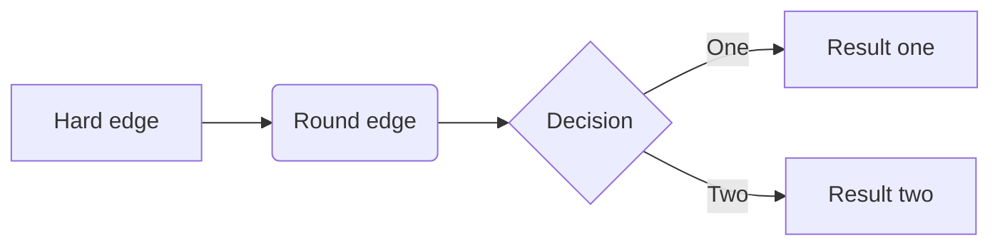
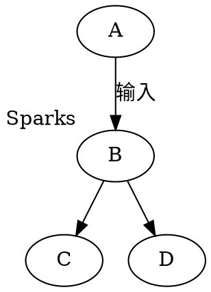
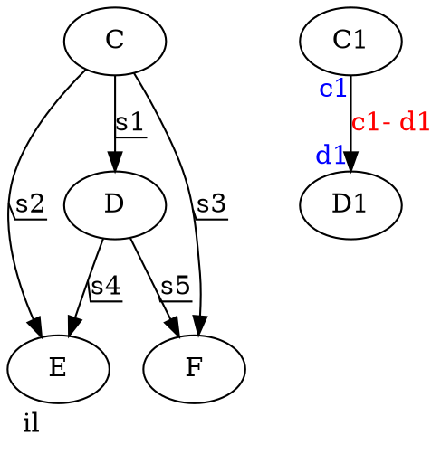
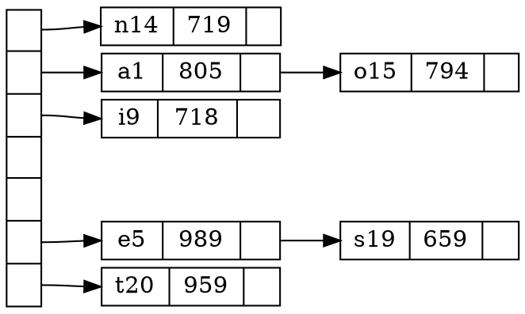
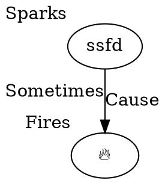
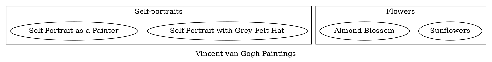
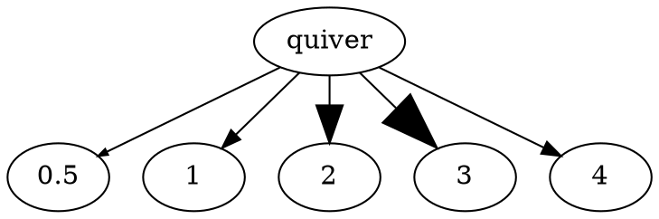
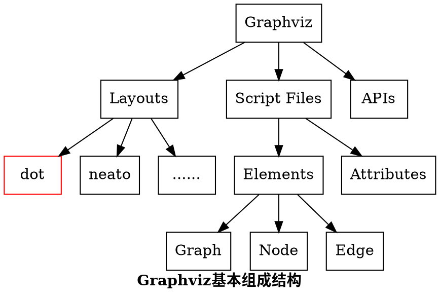

# learn-d2l
Dive into Deep Learning


[课程网站](https://courses.d2l.ai/zh-v2/)
[视频地址](https://space.bilibili.com/1567748478/channel/seriesdetail?sid=358497)


## Jupyter notebook快捷键

### 命令模式和编辑模式切换

鼠标点击任意一个```cell```或者按```Enter```回车键，进入编辑模式

鼠标点击```cell```区域外的任意一个位置或者直接按```Esc```键进入命令模式

### markdown和代码块的切换

在```命令模式```，```m```进入markdown模式、```y```则进入代码模式


## LaTex符号
[链接](https://zhuanlan.zhihu.com/p/109649028)

- 哈达玛积(Hadamard product):  $\odot$, 使用: ```$\odot$```
- $L_2$范数是向量元素平方和的平方根
$$
\begin{Vmatrix}
X
\end{Vmatrix}_2 = \sqrt{\sum_{i=1}^{n}{x_i^2}}
$$


| 描述      | 符号     | LaTex表示|
|----------|----------|---------|
| 一个空格 |$a\quad b$|```a\quad b```|
| 两个空格 |$a\qquad b$|```a\qquad b```|
| 空心字母 |$\mathbb R$, $\mathbb R^n$|```\mathbb R```, ```\mathbb R^n```|
| 集合属于 |$a\in b$|```a\in b```|
| 加粗 |$\pmb x$|```\pmb x```|
| 加粗 |$\mathbf x$|```\mathbf x```|
| 乘 |$\cdot$|```\cdot```|
| 积 |$\prod$|```\prod```|
| 一重积分 |$\int$|```\int```|
| 二重积分 |$\iint$|```\iint```|
| 曲线积分 |$\oint$|```\oint```|
| 极限 |$\lim$|```\lim```|
| 微分算子 |$\mathrm{d}x$|```\mathrm{d}x```|
| 求导符号 |$\partial$|```\partial```|
| 向量内积 |$\langle \pmb w, \pmb x \rangle$|```\langle \pmb w, \pmb x \rangle```|
| 帽子 |$\hat{y}$|```\hat{y}```|
|  |$\ell$|```\ell```|
|  |$\ast$|```\ast```|
|  |$$\mathop{\min}_{\pmb w, b} $|```\mathop{\min}_{\pmb w, b} ```|
|  |$\Leftrightarrow$|```\Leftrightarrow```|
|  |$\leftrightarrow$|```\leftrightarrow```|
|  |$\eta$|```\eta```|
|  |$\sigma$|```\sigma```|
|  |$\Delta$|```\Delta```|
|  |$\epsilon$|```\epsilon```|
| 大于等于 |$\ge$|```\ge```|
|  |$\{ \}$|```\{ \}```|
|  |$$f(x) = \begin{cases} 0 & \text{x=0} \\ 1 & \text{x!=0}\end{cases}$$|```f(x) = \begin{cases} 0 & \text{x=0} \\ 1 & \text{x!=0}\end{cases}```|


## 数学学习资源

### 矩阵求导
[矩阵求导的本质与分子布局、分母布局的本质（矩阵求导——本质篇）](https://zhuanlan.zhihu.com/p/263777564)

[矩阵求导公式的数学推导（矩阵求导——基础篇）](https://zhuanlan.zhihu.com/p/273729929)

[矩阵求导公式的数学推导（矩阵求导——进阶篇）](https://zhuanlan.zhihu.com/p/288541909)


### 极大似然估计

[图解极大似然估计推导与3D可视化](https://www.youtube.com/watch?v=C6a-SMY0H50)
[图解极大似然估计推导与3D可视化-github](https://github.com/aespresso/a_journey_into_math_of_ml)


## Jupyterlab使用
### 安装
```shell
$ pip install jupyterlab
```

### markdown插件支持mermaid画图
[jupyterlab-markup](https://github.com/agoose77/jupyterlab-markup)
```shell
$ pip install jupyterlab_markup
```
安装后便可以使用mermaid画图功能啦！



[Mermaid文档](https://mermaid-js.github.io/mermaid/#/flowchart)


**Mermaid方向**

- TB - top to bottom
- TD - top-down/ same as top to bottom
- BT - bottom to top
- RL - right to left
- LR - left to right


### 使用graphviz画图

```shell
$ pip install graphviz
```

```python
from graphviz import Digraph
# Create Digraph object
dot = Digraph()
# Add nodes 1 and 2
dot.node('1')
dot.node('2')
# Add edge between 1 and 2
dot.edges(['12'])
dot
```


相关连接:

[Notebook Feature Request: Enhanced Markdown Support For Graphs ](https://github.com/jupyter/notebook/issues/2300)

[markdown-preview-enhanced](https://github.com/shd101wyy/markdown-preview-enhanced)

[Markdown Preview Enhanced-支持图像](https://shd101wyy.github.io/markdown-preview-enhanced/#/zh-cn/diagrams)

### Graphviz

[Graphviz](https://graphviz.org/)

**先安装**
```shell
$ pip install graphviz
$ # https://h1ros.github.io/posts/introduction-to-graphviz-in-jupyter-notebook/
```














